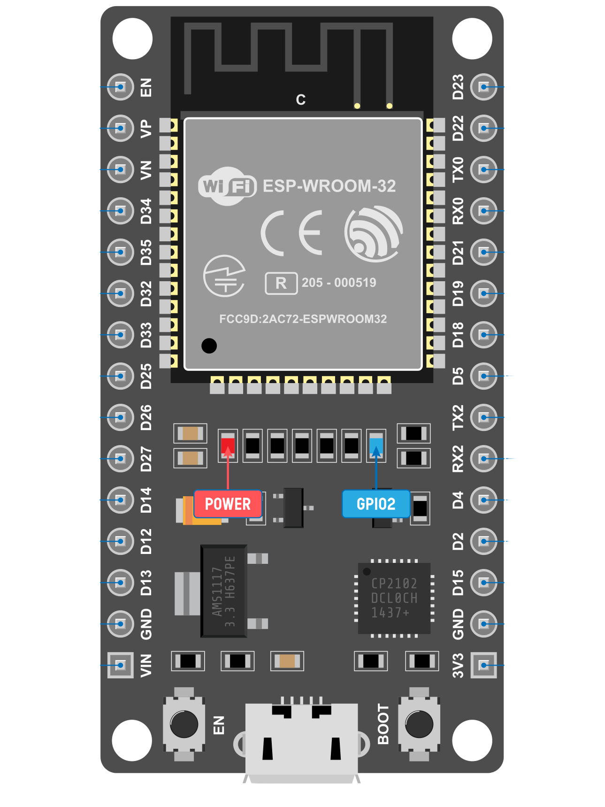
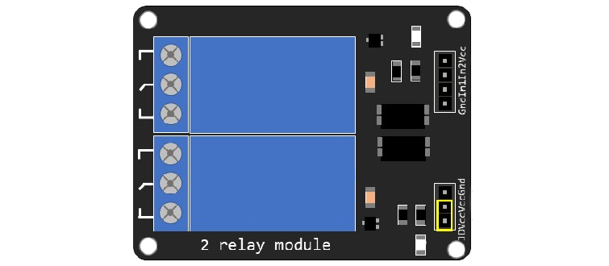

# **ESP32-LightControl-WiFi**

<p align="center">
  
  
</p>

A simple ESP32-based WiFi and Bluetooth light control system that allows users to turn a lamp ON and OFF remotely through a web browser or Bluetooth Serial commands.  
This project utilizes an ESP32 microcontroller, a relay module, and an HTTP web server to create a simple local IoT device for controlling electrical appliances without requiring an external WiFi router.

## **Project Structure**

ESP32-LightControl-WiFi/  
│  
├── src/  
│   └── main.cpp  
│  
├── platformio.ini  
│  
└── README.md

## **Features**

* **Dual Control Modes:** Control the light through WiFi Web Interface or Bluetooth Serial commands.  
* **WiFi Access Point (AP) Mode:** The ESP32 creates its own WiFi network, allowing direct connection without an external router.  
* **Web-Based Control Interface:** A simple HTML webpage is hosted on the ESP32 for controlling the relay.  
* **HTTP API Support:** Control the relay using simple HTTP GET requests.  
* **Bluetooth Serial Control:** Send commands through Bluetooth to switch the relay ON/OFF.  
* **PlatformIO Support:** Ready to build and upload using PlatformIO with the Arduino framework.

## **Hardware Requirements**

| Component | Quantity | Description |
| :---- | :---- | :---- |
| **ESP32 DevKit** | 1 | Main microcontroller board |
| **Relay Module** | 1 | Relay module controlled by ESP32 GPIO |
| **Lamp / LED** | 1 | Light source to be controlled |
| **Jumper Wires** | Several | Dupont connection wires |
| **USB Cable** | 1 | Used for programming and power |

## **Software & Libraries**

### **Development Environment**

* **PlatformIO** (VS Code Extension)  
* **Arduino Framework**

### **Libraries Used**

| Library | Purpose |
| :---- | :---- |
| Arduino.h | Core Arduino framework |
| WiFi.h | Creating WiFi Access Point |
| WebServer.h | Hosting HTTP web server |
| BluetoothSerial.h | Bluetooth communication |

## **Circuit Connection**

### **1\. ESP32 → Relay Module**

| ESP32 Pin | Relay Pin | Description |
| :---- | :---- | :---- |
| **VIN** | **VCC** | Relay power supply |
| **GND** | **GND** | Ground connection |
| **GPIO23** | **IN** | Relay control signal |

### **2\. Relay Module → Lamp**

| Relay Terminal | Connection |
| :---- | :---- |
| **COM** | USB \+5V |
| **NO** | Lamp Positive (+) |
| **Lamp Negative (-)** | USB GND |

## **Working Principle**

### **System Flow**

```text
ESP32 Boot

     |
     v

Initialize Relay GPIO

     |
     v

Create WiFi Access Point

     |
     v

Start HTTP Web Server

     |
     v

User Connects to ESP32 WiFi

     |
     v

Open Web Interface

     |
     v

Send ON/OFF Request

     |
     v

ESP32 Controls Relay

     |
     v

Lamp Turns ON/OFF
```

### **WiFi Control**

1. ESP32 starts a local WiFi Access Point.  
2. The user connects their smartphone or computer to the ESP32's network.  
3. The user opens the ESP32's web interface via a web browser.  
4. Pressing the web buttons sends HTTP requests to the ESP32.  
5. The ESP32 processes the request, changes the logic state on GPIO23, and controls the relay.

### **Bluetooth Control**

1. The ESP32 starts a Bluetooth Serial interface in parallel.  
2. The user pairs with the Bluetooth device.  
3. Sending the command 1 turns the relay **ON**.  
4. Sending the command 0 turns the relay **OFF**.

## **Configuration**

### **WiFi Access Point Settings**

* **SSID:** ESP32\_Relay\_AP  
* **Password:** 12345678  
* **IP Address:** 192.168.4.1

### **Bluetooth Configuration**

* **Bluetooth Name:** ESP32\_Relay

## **PlatformIO Configuration**

Add or verify the following configuration in your platformio.ini file:  
\[env:esp32dev\]  
platform \= espressif32  
board \= esp32dev  
framework \= arduino

upload\_speed \= 115200  
monitor\_speed \= 115200

board\_build.partitions \= huge\_app.csv

## **Installation & Setup**

### **1\. Clone Repository**

git clone https://github.com/sgPhilia/ESP32-LightControl-WiFi  
cd ESP32-LightControl-WiFi

### **2\. Open Project**

Open the cloned folder in **Visual Studio Code** with the **PlatformIO** extension installed.

### **3\. Build Firmware**

pio run

### **4\. Upload Firmware**

Connect your ESP32 to your computer using a USB cable and run:  
pio run \-t upload

### **5\. Monitor Serial Output**

To watch logs and runtime debugging output, run:  
pio device monitor

## **Usage Guide**

### **1\. WiFi Web Control**

1. Power on the ESP32.  
2. Connect your phone or computer to the WiFi network:  
   * **SSID:** ESP32\_Relay\_AP  
   * **Password:** 12345678  
3. Open a web browser and go to: **http://192.168.4.1**  
4. Press the **Turn ON** or **Turn OFF** buttons on the screen.

### **2\. Bluetooth Control**

1. Pair your smartphone or PC with the Bluetooth device named: **ESP32\_Relay**.  
2. Open any Serial Bluetooth Terminal application.  
3. Send the following commands to control the lamp:  
   * Send 1 to turn **ON** the relay.  
   * Send 0 to turn **OFF** the relay.

## **HTTP API**

The ESP32 hosts simple HTTP endpoints that allow you to programmatically control the relay:

| Endpoint | Method | Function |
| :---- | :---- | :---- |
| / | GET | Access and open the main web control page |
| /on | GET | Set GPIO23 HIGH to turn the relay **ON** |
| /off | GET | Set GPIO23 LOW to turn the relay **OFF** |

*Created with: ESP32 \+ Relay Module \+ PlatformIO \+ Arduino Framework*
